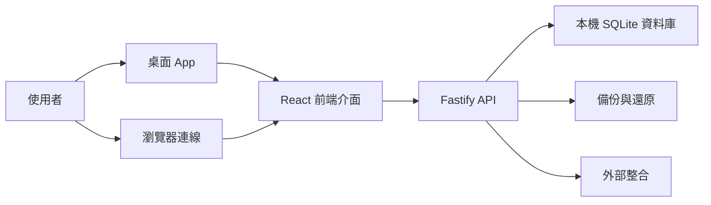
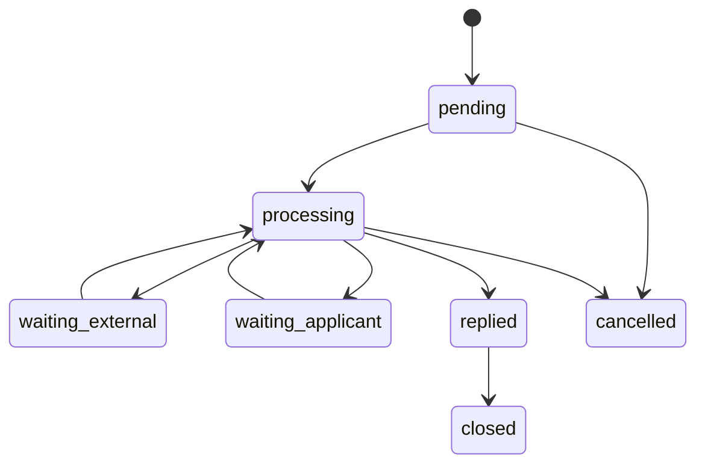
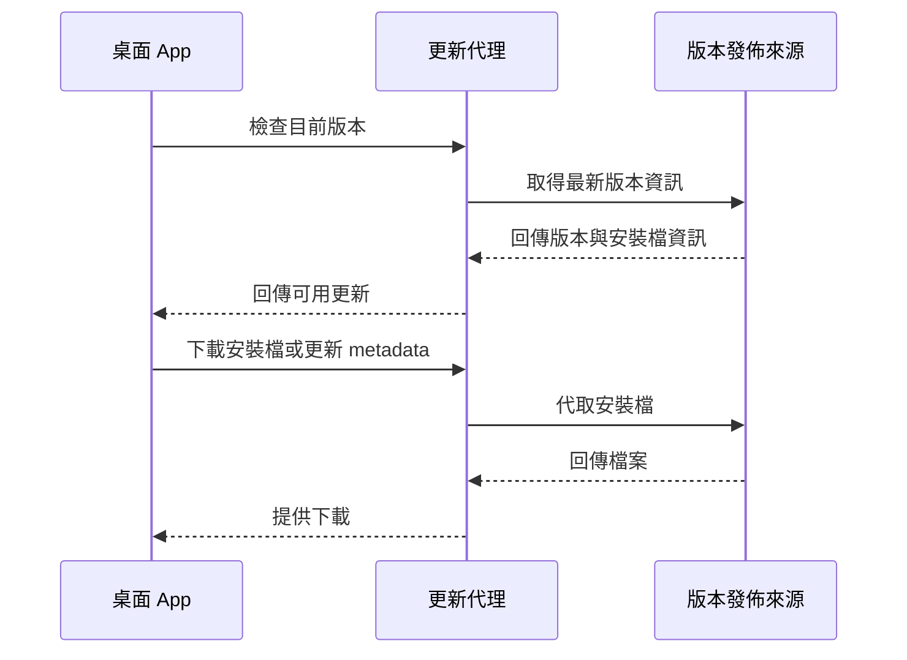

# 選民服務系統 v1.0.31 外部版完整功能與細節說明書

文件版本：v1.0.31  
適用對象：客戶、外部審計者、驗收人員、非內部開發團隊  
文件目的：以不揭露本機資料位置、內部路徑、金鑰、部署機密的方式，完整說明系統功能、使用流程、模組邊界、UI/UX 設計與交付狀態。

---

## 1. 系統定位

選民服務系統是一套面向民意代表服務處、地方服務團隊與助理團隊的本地端桌面系統。系統核心目標是把日常服務工作集中管理，包含選民資料、陳情案件、公文、行程、團體、活動、問卷、通知、禮儀支出、提案追蹤、報表分析與行政後台。

系統採桌面應用程式形式交付，可在單台電腦獨立使用，也可在受控區網或安全網路環境中提供多位工作人員共用。系統以本機資料庫為主，不依賴雲端資料庫才能運作，適合需要離線可用、部署簡單、資料掌握在服務處端的場景。

### 1.1 核心價值

| 面向 | 說明 |
|---|---|
| 服務集中化 | 將選民、陳情、公文、行程、團體與活動資料整合在同一套系統中。 |
| 作業標準化 | 以案件狀態、SLA、處理紀錄、任務與稽核紀錄建立一致工作流程。 |
| 團隊協作 | 支援不同角色權限、承辦人分派、待辦追蹤、交接與操作紀錄。 |
| 資料可追蹤 | 重要新增、修改、刪除、匯出、備份與設定操作皆可保留管理紀錄。 |
| 快速交付 | 以安裝檔方式部署，內建前後端服務與資料庫，不需額外建置大型伺服器。 |

### 1.2 適用場景

| 場景 | 適用性 | 說明 |
|---|---|---|
| 單一服務處日常使用 | 高 | 適合助理、主任、議員辦公室管理服務資料。 |
| 區網內多位助理共用 | 中高 | 可由一台主機提供後端服務，其他電腦透過瀏覽器連線。 |
| 外勤或離線工作 | 中 | 桌面端可在本機使用，但多人同步仍需網路環境。 |
| 大型全國性雲端 CRM | 低 | 本系統定位不是雲端 SaaS 或大規模分散式平台。 |
| 高度法遵或敏感個資場景 | 需額外治理 | 系統具備基本保護與稽核能力，但正式導入仍需搭配組織政策。 |

---

## 2. 技術與架構摘要

本章只描述外部可公開的技術架構，不包含本機資料存放位置、內部 repo 結構或機密設定。

| 層級 | 技術 |
|---|---|
| 桌面應用 | Electron |
| 前端 | React 18、TypeScript、Vite、Ant Design 5 |
| 後端 | Fastify、TypeScript |
| 資料庫 | SQLite WAL 模式 |
| 認證 | JWT、bcrypt 密碼雜湊 |
| 匯入匯出 | Excel、Word/HTML 文件輸出、列印頁面 |
| 圖表 | Recharts |
| 行程 | FullCalendar |
| 自動更新 | 支援私有版本更新代理與安裝包內建更新設定 |

### 2.1 高層架構



### 2.2 運作模式

| 模式 | 說明 |
|---|---|
| 桌面模式 | 使用者開啟安裝後的桌面應用，前端與後端由同一套應用啟動。 |
| 區網模式 | 服務處內可由指定電腦提供服務，其他工作站透過瀏覽器連線使用。 |
| 私有更新模式 | 若版本發佈來源不公開，可透過更新代理提供版本檢查與安裝檔下載。 |
| 離線模式 | 已安裝系統可在無網路狀況下使用本機功能，外部整合與更新功能需網路。 |

---

## 3. 使用者角色與權限

系統以角色控制功能權限，主要角色包含 `admin`、`supervisor`、`assistant`、`volunteer`。

| 角色 | 定位 | 典型使用者 |
|---|---|---|
| admin | 系統管理者 | 資訊管理者、服務處最高管理者 |
| supervisor | 業務主管 | 主任、資深助理、案件督導 |
| assistant | 一般助理 | 處理選民、陳情、公文、行程的日常工作者 |
| volunteer | 志工或臨時支援 | 主要查看資料，限制新增修改刪除 |

### 3.1 權限原則

| 原則 | 說明 |
|---|---|
| 最小可用權限 | 不同角色只開放其工作必要功能。 |
| 模組化授權 | 權限依選民、陳情、公文、行程、設定、報表等模組區分。 |
| 高風險操作限制 | 使用者管理、系統設定、備份還原、完整個資匯出等功能限管理角色。 |
| 操作可追蹤 | 重要操作會進入稽核紀錄，供管理者追蹤。 |

### 3.2 主要權限矩陣

| 功能 | admin | supervisor | assistant | volunteer |
|---|---:|---:|---:|---:|
| 儀表板查看 | 可 | 可 | 可 | 可 |
| 選民查看 | 可 | 可 | 可 | 可 |
| 選民新增/編輯 | 可 | 可 | 可 | 不可 |
| 選民刪除/匿名化 | 可 | 可 | 不可 | 不可 |
| 選民匯入/匯出 | 可 | 可 | 視設定 | 不可 |
| 陳情查看 | 可 | 可 | 可 | 可 |
| 陳情新增/編輯 | 可 | 可 | 可 | 不可 |
| 公文管理 | 可 | 可 | 可 | 不可 |
| 行程管理 | 可 | 可 | 可 | 查看 |
| 團體管理 | 可 | 可 | 可 | 查看 |
| 活動/問卷/通知 | 可 | 可 | 視權限 | 視權限 |
| 使用者管理 | 可 | 不可 | 不可 | 不可 |
| 系統設定與備份 | 可 | 可 | 不可 | 不可 |
| 操作紀錄 | 可 | 不可 | 不可 | 不可 |

---

## 4. 全域 UI/UX 設計

系統以服務處日常工作流為中心設計，目標是讓使用者能快速找到資料、快速建立案件、快速追蹤待辦，並在高資訊密度下保持可讀性。

### 4.1 主要介面結構

| 區域 | 功能 |
|---|---|
| 左側導覽 | 提供主要模組入口，例如儀表板、選民、陳情、公文、行程、團體、報表與後台。 |
| 頂部工具列 | 提供全域搜尋、使用者狀態、快捷操作、主題切換與系統提醒。 |
| 主內容區 | 呈現各模組列表、詳情、表單、統計圖表與操作流程。 |
| 抽屜/彈窗 | 用於新增、編輯、匯入、快速設定、來電處理與確認操作。 |
| 狀態提示 | 以 badge、tag、alert、empty state、loading skeleton 呈現目前狀態。 |

### 4.2 UX 原則

| 原則 | 說明 |
|---|---|
| 工作流優先 | 模組按照服務處真實工作情境排列，而不是單純資料表排列。 |
| 快速建立 | 常見資料可從列表、詳情、行程、陳情等入口快速建立。 |
| 就地設定 | 當欄位依賴類別管理時，輸入欄旁提供一鍵前往設定或管理入口。 |
| 預設安全操作 | 刪除、匯出完整資料、還原備份等高影響操作需確認。 |
| 明確回饋 | 成功、失敗、權限不足、網路錯誤皆提供可理解提示。 |
| 可掃描資訊 | 列表頁以篩選、排序、標籤、狀態色與 KPI 讓使用者快速判斷優先順序。 |

### 4.3 響應式與可用性

| 面向 | 說明 |
|---|---|
| 桌面優先 | 主要針對服務處工作站與筆電設計。 |
| 瀏覽器可用 | 區網模式下可由瀏覽器連線使用。 |
| 表格密度 | 大量資料頁面支援分頁、搜尋與篩選。 |
| 鍵盤與快捷操作 | 部分常用功能支援快捷鍵與快速搜尋。 |
| 明暗主題 | 支援日間與夜間模式。 |

---

## 5. 首次使用與登入

### 5.1 首次啟動流程

系統首次啟動時會建立基礎設定與預設管理帳號，並引導使用者完成初始設定。初始設定包含服務處名稱、管理員密碼設定提醒與基本系統設定。

### 5.2 登入流程

| 步驟 | 說明 |
|---|---|
| 輸入帳號密碼 | 使用者以系統帳號登入。 |
| 認證成功 | 後端核對密碼雜湊並簽發登入憑證。 |
| 載入權限 | 前端依使用者角色顯示可用功能。 |
| 閒置保護 | 系統可依設定在長時間閒置後自動登出。 |

### 5.3 帳號管理

管理者可新增使用者、調整角色、停用帳號、重設密碼，並在離職或職務異動時進行承辦資料交接。

---

## 6. 儀表板

儀表板是系統的工作入口，用於快速掌握今日重點、案件狀態與團隊工作負荷。

### 6.1 主要內容

| 區塊 | 功能 |
|---|---|
| KPI 卡片 | 顯示選民數、待處理陳情、今日行程、逾期案件等重點數字。 |
| 今日行程 | 顯示當日活動、會議、拜訪、諮詢等行程。 |
| 待處理陳情 | 顯示待辦、逾期、急件與需追蹤案件。 |
| 趨勢圖表 | 以月趨勢、類別、狀態、承辦人等維度顯示變化。 |
| 快捷操作 | 快速新增選民、陳情、行程、任務或進行搜尋。 |

### 6.2 使用情境

| 情境 | 操作 |
|---|---|
| 早會檢視 | 開啟儀表板查看今日行程與逾期案件。 |
| 主任督導 | 查看承辦人負荷與高風險案件。 |
| 助理接電話 | 透過搜尋快速找到選民或建立陳情。 |
| 每週檢討 | 查看案件趨勢、滿意度與結案效率。 |

---

## 7. 選民管理

選民管理是系統核心模組，負責維護選民基本資料、聯絡資訊、地址、標籤、關係、互動紀錄與服務歷史。

### 7.1 選民資料欄位

| 類別 | 欄位示例 |
|---|---|
| 基本資料 | 姓名、性別、生日、稱謂、身分識別欄位 |
| 聯絡資料 | 手機、電話、Email、LINE ID |
| 地址資料 | 戶籍縣市、鄉鎮區、村里、地址、通訊地址 |
| 分類資料 | 選區、標籤、來源、介紹人 |
| 工作資料 | 職業、公司、職稱 |
| 管理資料 | 備註、黑名單、啟用狀態、建立者 |

### 7.2 選民列表

| 功能 | 說明 |
|---|---|
| 分頁瀏覽 | 適合大量資料查詢。 |
| 關鍵字搜尋 | 支援姓名、電話、身分識別欄位等常用查詢。 |
| 條件篩選 | 可依縣市、鄉鎮區、村里、標籤、狀態等條件篩選。 |
| 快速操作 | 可進入詳情、新增、編輯、匯出或列印。 |
| 重複檢查 | 支援以手機或身分識別欄位檢查疑似重複資料。 |

### 7.3 選民詳情

選民詳情頁整合該選民所有相關資訊，避免助理需要在不同模組中來回查找。

| 分頁/區塊 | 說明 |
|---|---|
| 基本資料 | 顯示與編輯個人資料、地址與聯絡方式。 |
| 標籤 | 管理樁腳、志工、支持者、意見領袖等標籤。 |
| 關係人 | 建立親屬、鄰居、同事、朋友、樁腳等人際關係。 |
| 關注議題 | 紀錄該選民關心的議題與備註。 |
| 互動程度 | 支持度、是否為關鍵支持者、是否志工等。 |
| 聯絡紀錄 | 電話、拜訪、訊息、追蹤提醒與結果紀錄。 |
| 活動歷史 | 顯示與陳情、活動、問卷、聯絡相關的歷史事件。 |
| 附件 | 可上傳與該選民相關的圖片或文件。 |

### 7.4 選民合併

當系統發現重複選民時，可將舊資料合併至主要選民。合併會轉移相關案件、聯絡紀錄、活動紀錄與部分關聯資料，並保留合併歷史供日後追蹤。

### 7.5 選民刪除與匿名化

系統支援軟刪除與匿名化。軟刪除保留資料但不在預設列表出現；匿名化用於移除或去識別個資欄位。高影響操作會依權限控管並記錄操作。

### 7.6 Excel 匯入匯出

| 功能 | 說明 |
|---|---|
| 範本下載 | 提供固定欄位格式，降低資料整理成本。 |
| Dry-run 預覽 | 匯入前可預覽有效列、錯誤列與可能問題。 |
| 批次匯入 | 建立選民資料並支援標籤欄位。 |
| 遮罩匯出 | 預設匯出會遮罩敏感欄位。 |
| 完整匯出 | 僅管理者在提供理由後可匯出完整個資。 |

### 7.7 列印與標籤

系統支援選民名冊列印與地址標籤列印，可依使用情境選擇欄位與格式。

---

## 8. 陳情案件管理

陳情模組用於管理民眾反映問題、服務案件、追蹤處理進度與結案成果。

### 8.1 案件資料

| 類別 | 欄位示例 |
|---|---|
| 案件識別 | 自動案號、陳情日期、來源管道 |
| 陳情人 | 關聯選民、姓名、電話 |
| 內容分類 | 類別、子類別、地區、地址 |
| 處理狀態 | 待處理、處理中、等待外部、等待民眾、已回覆、已結案、取消 |
| 管理欄位 | 緊急程度、承辦人、期限、滿意度、建立者 |

### 8.2 案號規則

案件建立時會自動產生年度流水號。產生流程採交易控制，避免多人同時建立時發生重複案號。

### 8.3 案件流程



### 8.4 處理紀錄

每件陳情可新增多筆處理紀錄，記錄受理、轉介、回覆、追蹤、重新分派、電話聯絡、親訪與備註。這使案件處理過程可回溯，利於交接與督導。

### 8.5 SLA 與追蹤

| 功能 | 說明 |
|---|---|
| 逾期提醒 | 顯示逾期案件數與高風險案件。 |
| 急迫程度 | 支援一般、急件、重大案件。 |
| 待追蹤清單 | 集中列出需後續追蹤案件。 |
| 滿意度統計 | 可記錄結案滿意度並進行統計。 |

### 8.6 匯入匯出

陳情案件支援 Excel 範本、批次匯入與匯出。匯出可用於週報、主管檢討、移交或對外統計。

---

## 9. 待辦任務

任務模組用於管理服務處內部工作分派，並可與陳情、行程或其他工作流程連動。

| 功能 | 說明 |
|---|---|
| 任務列表 | 查看全部、今日、逾期或指定狀態任務。 |
| 新增任務 | 建立標題、內容、期限、承辦人與優先順序。 |
| 批次指派 | 將多筆任務指派給特定使用者。 |
| 批次完成 | 快速結束多筆已完成工作。 |
| 批次刪除 | 管理錯誤或不需要的任務。 |

---

## 10. 公文管理

公文模組用於管理收文、發文、內部處理與列印輸出。

### 10.1 功能範圍

| 功能 | 說明 |
|---|---|
| 收文/發文 | 支援不同公文類型。 |
| 自動文號 | 依年度與類型產生流水文號。 |
| 狀態管理 | 可追蹤待處理、處理中、已完成、歸檔等狀態。 |
| 搜尋與篩選 | 支援類型、日期、狀態、關鍵字等查詢。 |
| 列印與匯出 | 可依公文格式輸出列印或文件。 |
| 附件 | 支援附加掃描文件、圖片或 PDF。 |

### 10.2 使用情境

| 情境 | 說明 |
|---|---|
| 收到機關來文 | 建立收文、公文號、期限與承辦人。 |
| 發函回覆 | 建立發文、列印格式並歸檔。 |
| 主管追蹤 | 依期限查詢即將逾期公文。 |

---

## 11. 行程管理

行程模組用於管理服務處、議員、助理與團體活動的時間安排。

### 11.1 行程功能

| 功能 | 說明 |
|---|---|
| 月曆視圖 | 以月、週、日等形式查看行程。 |
| 新增行程 | 建立標題、時間、地點、類型、關聯資料。 |
| 跨日行程 | 支援跨日期範圍查詢與顯示。 |
| 衝突檢查 | 新增或編輯行程時檢查時間重疊。 |
| 列印行程表 | 可列印指定期間行程。 |
| Google Calendar | 可設定外部日曆同步。 |

### 11.2 行程類型

常見行程包含會議、地方活動、拜訪、會勘、法律諮詢、禮儀活動、服務處值班與其他自訂類型。

---

## 12. 法律諮詢

法律諮詢模組用於管理諮詢時段、預約名額與當日名單。

| 功能 | 說明 |
|---|---|
| 時段管理 | 管理可預約日期、時間與名額。 |
| 預約建立 | 新增民眾諮詢預約。 |
| 容量限制 | 同一時段不可超過設定名額。 |
| 今日諮詢 | 快速查看今日預約清單。 |
| 可用時段 | 查詢指定日期可預約時段。 |

---

## 13. 團體管理

團體模組用於管理社區、協會、宮廟、工會、同鄉會、校友會、慈善團體或其他地方組織。

### 13.1 團體資料

| 類別 | 欄位示例 |
|---|---|
| 基本資料 | 團體名稱、分類、地址、聯絡資訊 |
| 代表人物 | 負責人、聯絡人、關聯選民 |
| 成員 | 團體成員、角色、備註 |
| 活動 | 團體相關行程、活動與支出 |

### 13.2 成員管理

| 功能 | 說明 |
|---|---|
| 加入成員 | 將選民加入團體。 |
| 成員角色 | 設定理事長、總幹事、會員、志工等角色。 |
| 移除成員 | 從團體中移除指定成員。 |
| 關聯查詢 | 可從團體看到相關行程與費用。 |

---

## 14. 活動管理

活動模組用於規劃、管理與追蹤服務處活動，例如座談會、說明會、節慶活動、公益活動或地方拜訪。

| 功能 | 說明 |
|---|---|
| 活動建立 | 設定活動名稱、日期、地點、狀態與內容。 |
| 參與者管理 | 新增、更新或移除活動參與者。 |
| 參與狀態 | 記錄報名、出席、未出席等狀態。 |
| 問卷連結 | 可連結活動後問卷回饋。 |
| 活動成效 | 可由報表分析活動觸及與成效。 |

---

## 15. 問卷管理

問卷模組支援建立問卷、題目、回應、統計，並可將重要回應轉成陳情案件。

### 15.1 問卷功能

| 功能 | 說明 |
|---|---|
| 問卷建立 | 建立標題、描述、狀態與題目。 |
| 題目管理 | 新增或刪除題目。 |
| 回應收集 | 使用者或民眾可提交問卷回應。 |
| 統計分析 | 查看選項分布、回應數與交叉結果。 |
| 轉陳情 | 將有服務需求的回應轉成陳情案件。 |

### 15.2 適用情境

| 情境 | 說明 |
|---|---|
| 活動滿意度 | 活動後收集參與者回饋。 |
| 地方議題調查 | 收集居民對政策、交通、環境等議題看法。 |
| 服務需求收集 | 將民眾填寫需求轉入陳情流程。 |

---

## 16. 通知管理

通知模組用於建立訊息草稿、管理發送內容與追蹤通知觸及。

| 功能 | 說明 |
|---|---|
| 草稿建立 | 建立通知標題與內容。 |
| 草稿編輯 | 在送出前可修改通知。 |
| 發送 | 支援依系統設定的目標送出。 |
| 刪除 | 移除不再使用的草稿。 |
| 報表 | 可由通知觸及報表評估成效。 |

---

## 17. 禮儀、廠商與支出管理

此模組服務地方辦公室常見的禮儀、採購與活動支出管理需求。

### 17.1 禮儀管理

| 功能 | 說明 |
|---|---|
| 禮儀紀錄 | 建立與行程或民眾相關的禮儀紀錄。 |
| 禮品類別 | 管理花籃、罐頭塔、輓聯、禮金、其他品項等類別。 |
| 明細項目 | 紀錄品項、數量、金額、供應商。 |
| 行程關聯 | 可查詢某行程底下相關禮儀紀錄。 |

### 17.2 廠商管理

| 功能 | 說明 |
|---|---|
| 廠商資料 | 維護名稱、聯絡人、電話、地址、備註。 |
| 採購明細 | 查看與廠商相關的費用或品項。 |
| 年度統計 | 統計指定年度採購或支出狀況。 |
| 軟刪除 | 保留歷史資料但不在一般列表中顯示。 |

### 17.3 支出與預算

| 功能 | 說明 |
|---|---|
| 支出摘要 | 依年月統計支出。 |
| 年份列表 | 快速切換有資料的年度。 |
| 預算設定 | 建立預算項目與額度。 |
| 預算刪除 | 移除不再使用的預算設定。 |

---

## 18. 提案追蹤

提案模組用於追蹤政策提案、地方建設、議會提案或服務處內部專案。

| 功能 | 說明 |
|---|---|
| 提案列表 | 查看所有提案與狀態。 |
| 提案建立 | 建立標題、內容、類別、狀態與負責人。 |
| 提案詳情 | 顯示完整資訊與進度。 |
| 編輯更新 | 更新提案狀態、內容與備註。 |
| 統計 | 依狀態、類別、年度統計提案數。 |
| 匯出 | 將提案資料匯出為 Excel。 |

---

## 19. 聯絡紀錄

聯絡紀錄可獨立管理，也可附屬於特定選民。

| 功能 | 說明 |
|---|---|
| 全部聯絡紀錄 | 查看所有電話、拜訪、訊息或追蹤紀錄。 |
| 新增紀錄 | 可指定選民，也可先建立未歸戶紀錄。 |
| 待追蹤 | 查看需要後續追蹤的聯絡事項。 |
| 刪除 | 移除錯誤或不需要的紀錄。 |

---

## 20. 每日工作日誌

每日工作日誌供管理者記錄服務處每日摘要、重要事件、待追蹤事項與交接備註。

| 功能 | 說明 |
|---|---|
| 最近日誌 | 查看近期工作日誌。 |
| 指定日期 | 取得或建立特定日期日誌。 |
| 編輯保存 | 更新當日摘要與備註。 |
| 刪除 | 移除指定日期日誌。 |

---

## 21. 報表分析

報表模組提供跨資料的統計與洞察，協助主管掌握服務績效、地方需求與團隊負荷。

### 21.1 報表類型

| 報表 | 說明 |
|---|---|
| 月度趨勢 | 查看案件或服務量的月份變化。 |
| 週報表 | 彙整近期工作成果。 |
| 選民活躍度 | 分析選民互動與活動狀態。 |
| 選民生命週期 | 觀察從接觸到支持、參與的轉換。 |
| 地區滲透率 | 分析不同地區選民資料覆蓋程度。 |
| 地區落差 | 找出服務或資料薄弱區域。 |
| 地區熱區圖 | 觀察陳情或事件熱點。 |
| 承辦人負荷 | 分析每位承辦人的案件量與壓力。 |
| 結案效率 | 分析案件處理速度與結案表現。 |
| 高風險案件 | 找出逾期、急件或需主管介入案件。 |
| 議題趨勢 | 分析民眾關注議題變化。 |
| 類型地區交叉 | 比較不同地區的案件類型。 |
| 關鍵意見領袖 | 找出高連結、高影響力選民。 |
| 活動 ROI | 評估活動投入與參與成效。 |
| 久未聯絡選民 | 找出需重新接觸的選民。 |
| 通知觸及 | 分析通知送達與互動狀況。 |
| 滿意度排行 | 分析案件或服務滿意度。 |
| 問卷交叉 | 分析問卷回應間的關聯。 |
| 團隊效率 | 觀察整體工作效率與瓶頸。 |

### 21.2 報表使用方式

| 使用者 | 典型用途 |
|---|---|
| 主任 | 督導逾期案件、承辦人負荷與地區服務缺口。 |
| 助理 | 查詢自己負責案件與待辦。 |
| 議員 | 掌握整體服務成果、地方議題與活動成效。 |
| 外部審計 | 驗證系統是否具備足夠統計與稽核能力。 |

---

## 22. 全域搜尋

全域搜尋可快速查找選民、陳情、團體與行程等資料。

| 功能 | 說明 |
|---|---|
| 單一搜尋入口 | 不需先判斷資料在哪個模組。 |
| 多模組結果 | 依資料類型分組顯示。 |
| 快速跳轉 | 點選搜尋結果可進入詳情頁。 |
| 接電話情境 | 適合民眾來電時快速定位歷史紀錄。 |

---

## 23. 附件管理

附件模組支援將文件、圖片或 PDF 附加到選民、陳情、公文或其他業務資料。

| 功能 | 說明 |
|---|---|
| 檔案上傳 | 支援常見圖片與 PDF。 |
| 檔案檢查 | 後端檢查 MIME 類型與基本檔頭。 |
| 檔案下載 | 登入使用者可依權限下載附件。 |
| 檔案刪除 | 可移除不需要的附件紀錄。 |
| 安全標頭 | 下載時使用安全的檔名與內容標頭。 |

---

## 24. AI 輔助功能

系統提供 AI 輔助能力，協助提升文字整理與案件分類效率。AI 功能需由管理者設定外部 AI 服務。

| 功能 | 說明 |
|---|---|
| API 設定 | 管理 AI provider 與 API key。 |
| 測試連線 | 驗證 AI 設定是否可用。 |
| 陳情分類 | 協助判斷案件分類與子類別。 |
| 摘要 | 將長內容整理成重點摘要。 |
| 備註建議 | 依上下文產生處理備註建議。 |
| 提案解析 | 從文字中解析提案資料。 |

---

## 25. 外部整合

### 25.1 Google Calendar

| 功能 | 說明 |
|---|---|
| 狀態檢查 | 顯示目前是否已設定與授權。 |
| OAuth 設定 | 管理外部日曆授權資訊。 |
| 帳號管理 | 可更新或移除已連結帳號。 |
| 行程同步 | 可將系統行程同步到 Google Calendar。 |

### 25.2 LINE

| 功能 | 說明 |
|---|---|
| Webhook | 接收 LINE 平台事件。 |
| 狀態查詢 | 管理者可查看 LINE 綁定狀態。 |
| 選民綁定 | 可將 LINE 使用者與選民資料建立關聯。 |

---

## 26. 系統管理

系統管理模組供管理者維護使用者、類別、設定、稽核、備份、資料品質與健康狀態。

### 26.1 使用者管理

| 功能 | 說明 |
|---|---|
| 使用者列表 | 查看所有帳號與角色。 |
| 新增帳號 | 建立新使用者。 |
| 編輯帳號 | 調整姓名、角色、啟用狀態。 |
| 重設密碼 | 管理者可替使用者重設密碼。 |
| 停用帳號 | 禁止離職或不需使用者登入。 |
| 離職交接 | 將承辦資料轉交給其他使用者。 |

### 26.2 類別管理

類別管理是系統大量下拉選單與分類欄位的來源。常見類別包含選民標籤、陳情類別、公文類別、團體類別、行程類型、活動類型與禮品類別等。

| 功能 | 說明 |
|---|---|
| 類別列表 | 查看不同類型的分類項目。 |
| 新增類別 | 擴充自訂分類。 |
| 編輯排序 | 調整名稱、狀態與顯示順序。 |
| 刪除類別 | 移除不再使用的類別。 |
| 表單快捷入口 | 依賴類別的欄位旁提供設定入口，減少中斷。 |

### 26.3 系統設定

| 功能 | 說明 |
|---|---|
| 服務處資料 | 設定服務處名稱與基本資訊。 |
| 閒置登出 | 設定自動登出時間。 |
| 備份設定 | 管理備份頻率、保留份數與手動備份。 |
| 外部整合 | 設定 AI、Google Calendar、LINE 等整合。 |
| 更新檢查 | 檢查目前版本與可用更新。 |

### 26.4 操作紀錄

操作紀錄用於追蹤重要系統事件，包含使用者、動作、模組、目標、時間與相關資訊。此功能可協助稽核、問題排查與責任歸屬。

### 26.5 系統健康

系統健康功能可顯示資料庫大小、備份狀態、記憶體狀態、版本資訊與系統警告，協助管理者判斷是否需要維護。

### 26.6 資料品質

資料品質掃描可檢查重複資料、孤兒資料、附件遺失、資料欄位缺漏等問題，協助定期清理。

### 26.7 資料保留

資料保留功能可預覽與執行舊資料封存、前端錯誤清理、軟刪除選民去識別等程序。執行前需確認指令，避免誤操作。

---

## 27. 備份與還原

系統提供手動備份、自動備份、備份列表、備份下載、備份驗證與還原流程。

### 27.1 備份功能

| 功能 | 說明 |
|---|---|
| 手動備份 | 管理者可立即建立備份。 |
| 自動備份 | 系統可依設定定期建立備份。 |
| 保留策略 | 可保留最新備份並清理過舊備份。 |
| 簽章資訊 | 備份包含完整性驗證資料。 |
| 下載備份 | 管理者可下載備份檔。 |
| 刪除備份 | 可移除不需要的備份。 |

### 27.2 還原流程

| 步驟 | 說明 |
|---|---|
| 上傳備份 | 管理者選擇備份檔。 |
| 完整性檢查 | 系統檢查備份是否為有效資料庫與必要 schema。 |
| 建立待還原標記 | 系統將還原安排在安全時機執行。 |
| 重啟套用 | 重新啟動後套用還原。 |
| 失敗回復 | 若還原失敗，系統會嘗試保留原可用資料。 |

---

## 28. 匯入、匯出與列印

### 28.1 Excel 匯入

| 模組 | 能力 |
|---|---|
| 選民 | 範本、dry-run、批次建立、標籤解析。 |
| 陳情 | 範本、批次建立、緊急程度與類別轉換。 |
| 團體 | 範本、批次建立團體資料。 |

### 28.2 Excel 匯出

| 模組 | 能力 |
|---|---|
| 選民 | 支援篩選匯出，預設遮罩敏感欄位。 |
| 陳情 | 匯出案件資料、狀態、承辦人與日期欄位。 |
| 提案 | 匯出提案追蹤資料。 |
| 資料品質 | 匯出掃描結果供整理。 |

### 28.3 列印

| 頁面 | 功能 |
|---|---|
| 選民名冊 | 自訂欄位並列印名冊。 |
| 地址標籤 | 支援多種標籤格式。 |
| 行程表 | 依日期範圍列印行程。 |
| 公文 | 以公文格式列印或輸出。 |

---

## 29. 自動更新與版本交付

系統支援桌面版自動更新檢查。若版本來源為私有發布，可透過更新代理提供版本資訊與安裝檔下載。

### 29.1 更新流程



### 29.2 平台差異

| 平台 | 說明 |
|---|---|
| Windows | 可支援安裝版與免安裝版下載。 |
| macOS | 未簽章版本可能需手動拖曳安裝或允許開啟。 |
| 瀏覽器下載頁 | 可提供外部電腦下載安裝檔。 |
| 私有發佈 | 需更新代理或其他受控分發方式。 |

---

## 30. 資料模型摘要

系統資料模型以服務處工作流為核心，可分為以下類型。

| 類型 | 代表資料 |
|---|---|
| 身分與權限 | 使用者、角色、設定、操作紀錄 |
| 選民核心 | 選民、標籤、關係、關注議題、互動程度 |
| 服務案件 | 陳情、處理紀錄、任務、聯絡紀錄 |
| 行政資料 | 公文、附件、每日工作日誌 |
| 日程活動 | 行程、法律諮詢、活動、活動參與者 |
| 組織網絡 | 團體、團體成員、廠商 |
| 民意與傳播 | 問卷、問卷題目、回應、通知 |
| 財務與禮儀 | 禮儀紀錄、禮品類別、支出、預算 |
| 分析資料 | 報表、統計、資料品質掃描 |
| 整合資料 | Google Calendar、LINE、AI 設定 |

---

## 31. API 能力摘要

系統提供約兩百個 API 端點，採統一回應格式並以 JWT 驗證與模組權限控管。

### 31.1 API 分類

| 分類 | 能力 |
|---|---|
| Auth | 登入、登出、取得目前使用者、修改密碼。 |
| Voters | 選民 CRUD、搜尋、重複檢查、生日、匯入匯出、合併、匿名化。 |
| Petitions | 陳情 CRUD、處理紀錄、統計、逾期、追蹤、匯入匯出。 |
| Groups | 團體 CRUD、成員、關聯行程與費用、匯入。 |
| Schedules | 行程 CRUD、跨日查詢、衝突檢查。 |
| Consultations | 法律諮詢預約、時段管理、可用名額。 |
| Tasks | 任務 CRUD、今日任務、批次指派與完成。 |
| Documents | 公文 CRUD、文號、搜尋與歸檔。 |
| Events | 活動 CRUD、參與者、問卷回應。 |
| Surveys | 問卷 CRUD、題目、回應、統計、轉陳情。 |
| Notifications | 通知草稿、編輯、刪除、發送。 |
| Ceremonies | 禮儀紀錄、品項、禮品類別。 |
| Vendors | 廠商 CRUD、採購與統計。 |
| Expenses | 支出摘要、年度、預算。 |
| Proposals | 提案 CRUD、統計、匯出。 |
| Reports | 月趨勢、地區、效率、滿意度、活動 ROI 等報表。 |
| Admin | 使用者、類別、設定、稽核、健康、備份、資料品質、資料保留。 |
| Integrations | Google Calendar、LINE、AI。 |
| Search | 全域搜尋。 |
| Attachments | 附件上傳、下載、刪除。 |

### 31.2 回應格式

API 採一致回應概念：

```json
{
  "success": true,
  "data": {},
  "total": 0
}
```

錯誤時會回傳：

```json
{
  "success": false,
  "error": {
    "code": 400,
    "message": "錯誤說明"
  }
}
```

---

## 32. 安全、稽核與資料保護摘要

本章描述系統現有保護機制，不包含部署密碼、token 或內部設定值。

| 面向 | 現有機制 |
|---|---|
| 登入認證 | 帳號密碼登入、JWT 登入狀態。 |
| 密碼保存 | 使用 bcrypt 雜湊。 |
| 權限控管 | 依角色與模組權限限制功能。 |
| 操作稽核 | 重要新增、修改、刪除、匯出與管理操作可記錄。 |
| 匯出保護 | 選民匯出預設遮罩敏感欄位。 |
| 完整匯出管控 | 完整個資匯出限管理者並需填寫理由。 |
| 備份完整性 | 備份可附帶雜湊與簽章資訊供驗證。 |
| 附件防護 | 檢查允許檔案類型與基本檔頭。 |
| 前端錯誤收集 | 登入後可回報前端錯誤供管理者排查。 |
| 敏感設定 | 敏感整合設定可加密儲存。 |

---

## 33. 效能與容量特性

| 面向 | 說明 |
|---|---|
| 資料庫 | 採 SQLite WAL，適合本地端與小型團隊使用。 |
| 多人讀取 | 支援多讀者情境。 |
| 多人寫入 | 寫入仍受 SQLite 單寫者特性限制，適合服務處規模，不適合大型雲端高併發。 |
| 大量列表 | 主要列表支援分頁、搜尋、篩選。 |
| 匯入 | Excel 匯入支援預覽與批次處理。 |
| 圖表 | 報表以 API 聚合資料後呈現。 |
| 桌面啟動 | 桌面 App 會啟動本機後端並載入前端介面。 |

---

## 34. 已驗證交付狀態

截至 v1.0.31，系統已完成以下交付項目。

| 類別 | 狀態 |
|---|---|
| 核心模組 | 已具備選民、陳情、公文、行程、團體、任務、活動、問卷、通知、禮儀、報表、後台。 |
| 桌面安裝 | 已支援 macOS 與 Windows 打包流程。 |
| 私有更新 | 已支援更新代理與安裝包內建更新設定。 |
| API 測試 | 已建立後端整合測試與功能測試。 |
| E2E 測試 | 已建立主要頁面與角色流程測試。 |
| UI 收斂 | 已完成主要模組 UI/UX 收斂與類別快捷入口改善。 |
| 備份還原 | 已具備備份、驗證、還原與失敗回復流程。 |
| 外部審計文件 | 已具備外部審計提示與交接資料。 |

---

## 35. 已知限制

| 限制 | 說明 |
|---|---|
| 非大型 SaaS 架構 | 系統定位為本地端或小型團隊使用，不是雲端多租戶平台。 |
| 多機共用需規劃 | 若多人共用，需指定穩定主機與安全網路環境。 |
| 私有版本分發需代理 | 若版本來源不公開，外部電腦無法直接匿名下載，需更新代理或受控下載方式。 |
| macOS 簽章限制 | 未簽章 macOS 安裝檔可能需要使用者手動允許開啟。 |
| 大量併發寫入不適合 | SQLite 適合服務處規模，不適合高頻大量同時寫入。 |
| 個資治理仍需制度 | 系統提供工具，但組織仍需建立權限、備份、匯出、保存與刪除政策。 |

---

## 36. 外部驗收建議

外部驗收可依以下流程進行。

### 36.1 安裝與啟動

| 項目 | 驗收方式 |
|---|---|
| 安裝檔可執行 | 於目標平台安裝並開啟系統。 |
| 登入成功 | 使用測試帳號登入。 |
| 首頁載入 | 儀表板正常顯示 KPI 與清單。 |
| 版本顯示 | 系統設定或更新頁顯示目前版本。 |

### 36.2 核心流程

| 流程 | 驗收方式 |
|---|---|
| 選民新增 | 新增一筆測試選民並查詢。 |
| 陳情建立 | 建立陳情並確認案號、狀態、處理紀錄。 |
| 行程建立 | 建立行程並測試衝突提示。 |
| 公文建立 | 建立收文或發文並確認文號。 |
| 團體成員 | 建立團體並加入選民。 |
| 匯入匯出 | 下載範本、dry-run、匯出 Excel。 |
| 備份還原 | 建立備份、查看列表、驗證備份。 |

### 36.3 權限與稽核

| 項目 | 驗收方式 |
|---|---|
| 角色限制 | 使用不同角色登入，確認不可用功能被阻擋。 |
| 操作紀錄 | 執行新增、修改、刪除後查看稽核紀錄。 |
| 匯出管控 | 測試遮罩匯出與完整匯出理由。 |

### 36.4 UI/UX

| 項目 | 驗收方式 |
|---|---|
| 搜尋效率 | 測試全域搜尋與各列表篩選。 |
| 表單完整性 | 測試必填欄位、錯誤提示與成功訊息。 |
| 類別捷徑 | 在有類別欄位的表單旁確認可前往設定。 |
| 響應式 | 以桌面與瀏覽器視窗縮放測試主要頁面。 |

---

## 37. 導入建議

| 階段 | 目標 | 建議工作 |
|---|---|---|
| 試用期 | 確認流程符合服務處習慣 | 使用測試資料跑完整選民、陳情、行程、公文流程。 |
| 小規模導入 | 建立基本資料與角色 | 建立帳號、分類、備份策略與操作規範。 |
| 正式導入 | 進入日常作業 | 匯入正式資料、指定管理者、定期備份與稽核。 |
| 優化期 | 根據使用回饋調整 | 收集痛點，優化表單、報表、權限與流程。 |

---

## 38. 結論

選民服務系統 v1.0.31 已具備完整的服務處日常作業能力，涵蓋選民資料、陳情案件、公文、行程、團體、任務、活動、問卷、通知、禮儀、支出、提案、報表、備份、稽核與系統管理。

系統最適合單一服務處或小型團隊使用，具備桌面部署簡單、資料本地掌握、功能完整與更新可控等優點。若要投入正式含個資作業，建議搭配明確的使用者權限政策、備份制度、匯出審核流程與定期資料品質檢查。

